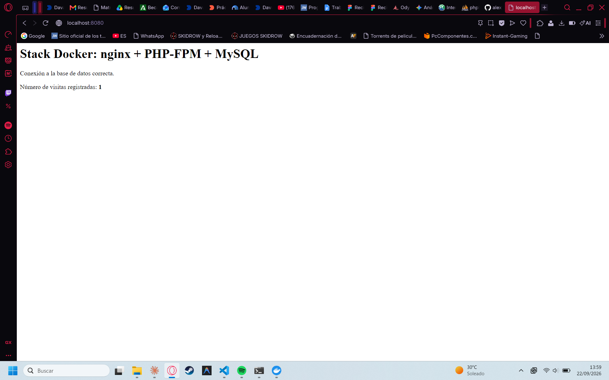

# Stack LEMP con Docker Compose (nginx + PHP-FPM + MySQL)

Alternativa a XAMPP para desarrollo web local: en vez de instalar Apache, PHP y
MySQL directamente en el sistema, cada servicio corre en su propio contenedor
Docker, aislado y desechable.

## Servicios

| Servicio | Imagen / build | Función |
|----------|-----------------|---------|
| `web`    | `nginx:1.27-alpine` | Recibe las peticiones HTTP en el puerto `8080` y las reenvía a PHP-FPM |
| `php`    | `php/Dockerfile` (PHP 8.3-FPM) | Ejecuta el código PHP y se conecta a la base de datos con PDO |
| `db`     | `mysql:8.0` | Almacena los datos de la aplicación |

## Cómo levantarlo

```bash
git clone <URL-de-este-repositorio>
cd <carpeta-del-repositorio>
cp .env.example .env        # Configurar contraseñas (o copiar desde la plantilla)
docker compose up -d
```

Después abre [http://localhost:8080](http://localhost:8080) en el navegador.

La primera vez que se carga la página, `src/index.php` crea automáticamente
una tabla `visitas` en la base de datos `appdb` y muestra cuántas veces se ha
cargado la página, para comprobar que los tres contenedores se comunican
correctamente.

## Estructura del repositorio

```
.
├── .env                   # Variables de entorno y contraseñas (ignorado por Git)
├── .env.example           # Plantilla pública de variables de entorno
├── .gitignore             # Reglas de exclusión de Git (protege el .env)
├── docker-compose.yml     # Define los tres servicios y su conexión
├── php/
│   └── Dockerfile         # Imagen PHP 8.3-FPM con extensión pdo_mysql
├── nginx/
│   └── default.conf       # Configuración de nginx (fastcgi_pass a php:9000)
├── src/
│   └── index.php          # Código PHP de prueba (conexión PDO)
└── README.md
```

## Detener y limpiar

```bash
docker compose down          # Para los contenedores
docker compose down -v       # Para los contenedores y borra el volumen de datos
```

## Captura de pantalla

<!-- Sustituye esta línea por la imagen real, por ejemplo: -->



--------------------------------------------

## Proceso de desarrollo

Este es mi primer proyecto usando Docker, así que fui avanzando paso a paso, entendiendo cada parte antes de pasar a la siguiente.

### 1. Definir la arquitectura

Tuve que separar el proyecto en tres contenedores: uno para nginx (servidor web), uno para PHP-FPM (ejecuta el código) y uno para MySQL (base de datos), en vez de instalarlo todo junto como en XAMPP. Cada uno vive en su propia carpeta dentro del repositorio (`nginx/`, `php/`, `src/`) para mantener el proyecto organizado.

### 2. `docker-compose.yml` — el archivo que lo organiza todo

Fue el primer archivo que escribí, porque describe qué contenedores existen y cómo se conectan entre sí. Definí los tres servicios (`web`, `php`, `db`), el mapeo de puertos (`8080` de mi ordenador al `80` del contenedor de nginx), los volúmenes para que mi código en `src/` fuera visible dentro del contenedor sin copiarlo a mano, y las variables de entorno de MySQL (usuario, contraseña, nombre de la base de datos) para que se autoconfigure al arrancar.

### 3. `php/Dockerfile` — construir mi propio PHP

La imagen oficial de PHP no trae de fábrica lo necesario para hablar con MySQL, así que creé un `Dockerfile` propio: partí de `php:8.3-fpm` y añadí las extensiones `pdo` y `pdo_mysql`, que son las que permiten usar la clase `PDO` en el código para conectarse a la base de datos. Es la primera vez que construyo una imagen en vez de usar una ya hecha.

### 4. `nginx/default.conf` — reenviar las peticiones PHP

Configuré nginx para que, cuando detecte que se pide un archivo `.php`, no intente servirlo directamente (no sabe ejecutar PHP), sino que la reenvíe con `fastcgi_pass php:9000` al contenedor `php`, usando el nombre del servicio como dirección dentro de la red interna de Docker.

### 5. `src/index.php` — comprobar que todo funciona de verdad

Escribí un script que se conecta a la base de datos con PDO, crea una tabla `visitas` si no existía, guarda un registro cada vez que se carga la página y muestra el total. Lo hice así, y no solo un "Hola mundo", para tener una prueba real de que los tres contenedores se comunican entre sí (nginx → PHP → MySQL).

### 6. Probarlo en local antes de subir nada

Con `docker compose up -d` levanté los tres contenedores a la vez y comprobé en `http://localhost:8080` que la página cargaba y el contador de visitas aumentaba en cada recarga, para detectar errores antes de subir el código.

### 7. Ir guardando el progreso con Git

Fui haciendo un commit por cada pieza completada (primero el `docker-compose.yml`, luego el Dockerfile, luego la configuración de nginx, luego el PHP, y por último la documentación), en vez de un único commit final con todo junto.

### 8. Subirlo a GitHub

Creé un repositorio público, lo conecté al local con `git remote add origin` y subí todo con `git push`, autenticándome con un token de acceso personal.

